<div align="center">

  

  <br><br>

  <p>La piattaforma definitiva per la gestione e la fruizione della mobilità urbana sostenibile.</p>

</div>

<!-- BADGES -->
<div align="center">
  
  
  
  
  
  
  
  
</div>

---

<details>
  <summary>Table of Contents / Indice</summary>
  <ol>
    <li><a href="#-il-progetto">Il Progetto</a></li>
    <li><a href="#-caratterizzazione-del-sistema">Caratterizzazione del Sistema</a></li>
    <li><a href="#-struttura-del-repository">Struttura del Repository</a></li>
    <li><a href="#-lo-sviluppo-ai-e-metodologie">Lo Sviluppo (AI e Metodologie)</a></li>
    <li><a href="#-architettura-e-componenti">Architettura e Componenti</a>
      <ul>
        <li><a href="#1-server-console-operativa-e-backend-python">Server (Console Operativa e Backend Python)</a></li>
        <li><a href="#2-web-dashboard-flutter-web">Web Dashboard (Flutter Web)</a></li>
        <li><a href="#3-app-mobile-flutter-iosandroid">App Mobile (Flutter iOS/Android)</a></li>
      </ul>
    </li>
    <li><a href="#-requisiti-e-servizi-black-box-analisi-reale">Requisiti e Servizi Black Box (Analisi Reale)</a></li>
    <li><a href="#-alternative-tecnologiche">Alternative Tecnologiche</a></li>
    <li><a href="#-limitazioni-e-sistemi-simulati-mock">Limitazioni e Sistemi Simulati (Mock)</a></li>
    <li><a href="#-elementi-sensibili-non-inclusi-privacy">Elementi Sensibili Non Inclusi (Privacy)</a></li>
    <li><a href="#-per-sviluppatori-esterni-avvio-locale">Per Sviluppatori Esterni (Avvio Locale)</a></li>
    <li><a href="#-testing-e-collaudo">Testing e Collaudo</a></li>
    <li><a href="#-problematiche-note-e-troubleshooting">Problematiche Note e Troubleshooting</a></li>
    <li><a href="#-evoluzione-e-migliorie-future">Evoluzione e Migliorie Future</a></li>
    <li><a href="#-licenza-diritti-e-versioning">Licenza, Diritti e Versioning</a></li>
  </ol>
</details>

---

## 🍃 Il Progetto

**LEAF Mobility** è un sistema software integrato end-to-end per la gestione della Smart Mobility nella città fittizia di Zootropolis, realizzato come caso di studio dell'anno accademico 2025/26 per il corso di **Ingegneria del Software** (ITPS, Università degli Studi di Bari — Aldo Moro). I professori del corso, membri del **SERLAB** (Software Engineering Research Laboratory), hanno fornito al team tutto il materiale e gli strumenti necessari per lo sviluppo di una piattaforma che fosse il più possibile vicina al mercato e agli standard professionali.

Il sistema è stato progettato e sviluppato dal gruppo **SunGroup**, composto da:
- *Convertino Stefano*
- *Lamanna Manuel Antonio*
- *Gallesi Victor*
- *Gallesi Jarno*

Progettato per essere scalabile e modulare, offre strumenti dedicati sia agli **operatori di flotta** (OP), sia alla **Pubblica Amministrazione** (PA), sia agli **utenti finali** (UT) che noleggiano i veicoli. L'ecosistema software si compone di un **robusto backend Python a tre tier** (che espone API RESTful sicure interagendo con hardware e database), e di **due client front-end scritti in Dart/Flutter** (un'App Mobile e una Web Dashboard). La soluzione copre tutto il ciclo di vita del noleggio: dalla registrazione con verifica dell'identità (e-KYC), alla prenotazione del mezzo tramite app, allo sblocco IoT, fino al monitoraggio live, alla reportistica avanzata e alle logiche di Geofencing lato dashboard.

---

## 🧬 Caratterizzazione del Sistema

LEAF Mobility non è un semplice esercizio didattico, ma un **sistema software** completo nel senso dato dall'ingegneria del software: un prodotto ad alta qualità corredato da documentazione completa (requisiti, progettazione, manuale d'uso), capace di accogliere dati persistenti e voluminosi, accessi concorrenti, integrazione tra domini e decine di schermate operative — il profilo tipico di un'**applicazione d'impresa** (Ghezzi, Jazayeri, Mandrioli).

### Le tre figure dell'ecosistema

| Ruolo | Sigla | Funzione | Interfaccia |
|---|---|---|---|
| **Utente** | UT | Noleggia veicoli elettrici (e-bike, e-scooter, auto) pagando a consumo o con abbonamento. Può richiedere assistenza, attivare l'SOS e consultare lo storico corse. | App Mobile (Flutter) |
| **Operatore di Flotta** | OP | Gestisce la flotta, monitora la telemetria in tempo reale, coordina la manutenzione, risponde ai ticket di assistenza e configura le regole operative (incentivi, soglie). | Web Dashboard |
| **Pubblica Amministrazione** | PA | Analizza i dati aggregati e anonimi sulla mobilità urbana (heatmap, impatto ecologico, flussi di traffico) per la pianificazione della viabilità. Può istituire zone a velocità ridotta o cantieri. | Web Dashboard |

### Veicoli e modello di business

La flotta comprende **biciclette elettriche**, **monopattini elettrici** e **automobili elettriche** condivise. Il sistema di tariffazione è flessibile: **pay-per-use** (addebito a fine corsa in base a tempo e distanza), **abbonamenti periodici** (settimanali/mensili), **incentivi al parcheggio** in aree designate (crediti bonus) e **sconti geografici** per stimolare la domanda nelle zone meno servite.

### 18 casi d'uso documentati

Il progetto è corredato da **18 casi d'uso** formali (UC01–UC18), ciascuno con scenari base e alternativi e un diagramma di sequenza associato:
- **7 casi d'uso Utente** — gestione account e KYC, profilo/pagamenti/abbonamenti, ricerca mezzi su mappa, stime tempi/costi, ciclo di vita della corsa (inizio/pausa/fine + fatturazione), assistenza e SOS, gestione noleggi simultanei.
- **6 casi d'uso Operatore** — log/report, monitoraggio mappa e telemetria, manutenzione e ticket, configurazione regole e incentivi, controllo remoto e allarmi, gestione utenti e account PA.
- **5 casi d'uso PA** — accesso e gestione account, heatmap e dashboard, estrazione report, definizione aree limitate, gestione variabilità (cantieri, grandi eventi).

### Garanzie di qualità (ISO 25000)

Lo sviluppo adotta esplicitamente le **caratteristiche di qualità** della famiglia **ISO 25000** (SQuaRE):

| Caratteristica | Come è garantita |
|---|---|
| **Manutenibilità** | Codice lintato (`Ruff`, `flutter analyze`), documentazione Doxygen, governance del debito tecnico tramite metodo SQALE |
| **Prestazioni** | Dashboard real-time ≤ 5 secondi (IIN-20), SOS ≤ 5 secondi (IIN-18), propagazione configurazione mappa ≤ 30 secondi (IIN-21) |
| **Affidabilità** | Sincronizzazione offline degli stati di noleggio con ripristino automatico alla riconnessione |
| **Usabilità** | UI minimalista «on-the-go», funzionalità core apprendibili in meno di 5 minuti (IIN-2) |
| **Sicurezza** | AES-256-GCM a riposo, MFA obbligatoria per OP/PA, RBAC per ruolo, conformità GDPR, anonimizzazione dati PA |
| **Verificabilità** | Gate CI/CD automatizzati (13 controlli), copertura test ≥ 80%, analisi statica dei tipi (`mypy --strict`) |

---

## 📂 Struttura del Repository

Il repository è diviso in macro-aree che separano nettamente le logiche client da quelle server:

```text
LEAF_Mobility/
├── client/
│   ├── app_mobile_utente/        # Codice sorgente Flutter dell'App per iOS/Android
│   └── web_dashboard/            # Codice sorgente Flutter della Dashboard SPA
├── docs/                         # Immagini, loghi e documentazione
├── releases/                     # APK rilasciati dell'App Mobile
├── Report/                       # Report CI/CD, documentazione Doxygen, debito tecnico
│   ├── kpi_non_economici.md      # Analisi multidimensionale ESG, team e rischi
│   └── dashboard_kpi_opensource.py # Dashboard interattiva Plotly/Dash (template)
├── wiki/                         # Direttive di progetto
└── server/
    ├── presentation_tier/        # Controller API (FastAPI) e sicurezza
    ├── business_tier/            # Core logic (Corse, Flotta, e-KYC, Analitica)
    ├── integration_tier/         # Accesso dati Firestore e gateway esterni (IoT, Mappe)
    ├── runtime/                  # Bootstrap FastAPI, metriche, monitor HW, audit
    ├── console_operativa/        # TUI di amministrazione per il sistema
    └── tests/                    # Unit test e integration test automatizzati
```

## 📝 Lo Sviluppo (AI e Metodologie)

<div align="left" style="display: flex; gap: 10px; margin-bottom: 10px;">
  
  
  
</div>

Per la realizzazione del sistema è stato applicato il framework agile **Scrum**, con quattro sprint totali. La progettazione iniziale è stata svolta in collaborazione dai quattro membri, e successivamente lo sviluppo è stato fortemente accelerato tramite l'uso dell'Intelligenza Artificiale.

### Scrum: il Telaio

**Scrum** è il framework agile (Schwaber & Sutherland) adottato per governare la direzione strategica del progetto: *cosa* costruire e *perché*. Il lavoro è stato organizzato in **quattro sprint** — dallo Sprint 0 (skeleton architetturale, backlog, direttive, diagrammi UML) fino allo Sprint 3 (server end-to-end, client collegati, test live su dispositivo reale) — con cerimonie di planning, review e retrospettiva a ogni iterazione.

### Stream Coding: il Motore

Lo sviluppo ha integrato Scrum con lo **Stream Coding** (Moretto, 2025): una metodologia che applica i **7 principi dell'Ingegneria del Software** (Ghezzi et al.) all'era della generazione di codice con LLM. La tesi centrale è: *«La velocità non è l'obiettivo, è un sintomo. La chiarezza è la causa.»*

In pratica, il valore non sta nel far generare codice velocemente, ma nel mantenere una **specifica chiara e autoritativa** da cui il codice discende in modo deterministico. Questo approccio si contrappone al *Vibe Coding* (conversazionale, non strutturato), che uno studio METR 2025 ha dimostrato rallentare gli sviluppatori senior del 19% pur dando l'illusione di un +20% di velocità.

### Il Framework DOE

La fusione tra Scrum e Stream Coding è stata realizzata tramite il framework proprietario **DOE** (Directive · Orchestration · Execution):

| Layer | Ruolo | Responsabilità |
|---|---|---|
| **[D] Directive** | Il Manager | Tutte le regole, le SOP e i vincoli architetturali vivono in un unico file di direttive, consultato prima di ogni azione. |
| **[O] Orchestration** | L'Agente AI | L'AI struttura la logica e la spinge in codice deterministico — nessuna logica funzionale è lasciata alla stocasticità del modello. |
| **[E] Execution** | Il Codice | Tutta la logica è codice determinato: Python lato server, Dart lato client. |

L'AI ha operato con una **distribuzione del tempo 40/20/20**: il 40% del lavoro è stato dedicato alla pianificazione e all'architettura (specifiche, direttive, diagrammi UML), circa il 15% all'implementazione automatica task-level, e il resto all'integrazione e ai test — con debugging e refactoring quasi nulli rispetto allo sviluppo tradizionale.

Durante il processo sono stati applicati:
- **Prompt Engineering** strutturato e **Framework DOE**.
- Utilizzo di **WIKI LLM** per la gestione della conoscenza.
- Regole non violabili per l'AI (Direttive di progetto).
- Standard rigorosi per la documentazione (Doxygen, template vincolanti).
- Standard di testing e tracciabilità del debito tecnico (metodo SQALE).
- Standard di Sicurezza integrati nelle possibilità del gruppo.

### Il "Second Brain": WIKILLM

L'IA principalmente usata è stata **Claude Code**, con l'integrazione vitale di un "second brain" WIKILLM. Questo sistema permette un uso estremamente più efficiente dei token d'uso del servizio.

L'idea ha radici storiche: nel 1945 Vannevar Bush immaginò il *Memex*, un dispositivo capace di creare **tracce associative** tra documenti. Una WIKI-LLM ne è l'erede digitale: invece di recuperare frammenti dalle fonti grezze a ogni domanda (come fa il RAG tradizionale), l'LLM **compila e mantiene una wiki persistente e interconnessa** che si arricchisce a ogni fonte ingerita.

Dopo la creazione della WIKI-LLM (ispirata al repository [github.com/laramohan/wikillm](https://github.com/laramohan/wikillm.git)), l'AI è stata addestrata inserendo articoli, documenti e altre fonti nella cartella `raw`. Segnalando questi inserimenti all'AI, questa processa i file per creare una **rete di file markdown** che permettono un orientamento e una memorizzazione più facile dei concetti tramite puntatori.

<div align="center">
  <br>
  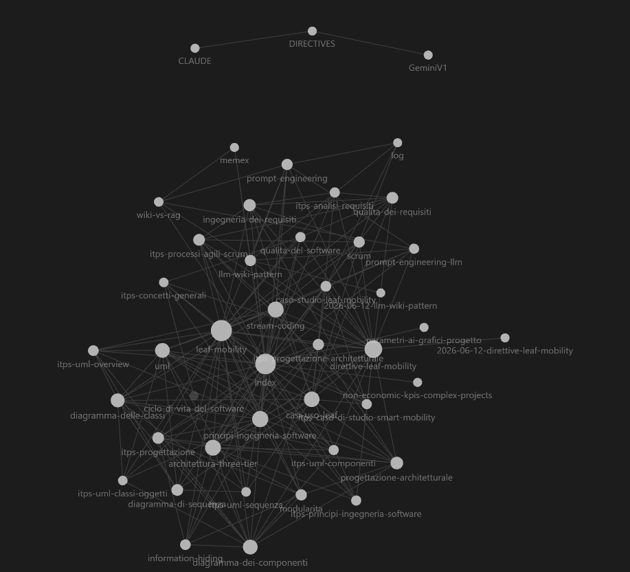
  <p><em>Grafo della conoscenza e struttura della documentazione.</em></p>
  <br>
</div>

I **vantaggi sostanziali** di questo approccio sono stati:
- **Ottimizzazione Efficiente dei Token:** Inviando solo l'estratto rilevante recuperato dalla memoria anziché interi documenti, si riduce il rumore informativo e si migliora la precisione della risposta.
- **Aggiornamenti in Tempo Reale senza Re-addestramento:** L'aggiornamento della memoria esterna rende l'AI immediatamente informata sui nuovi cambiamenti del progetto, eliminando i costosi cicli di fine-tuning.
- **Riduzione drastica delle Allucinazioni:** Il modello è vincolato a rispondere basandosi *esclusivamente* sui dati recuperati dalla memoria secondaria. Se il dato non esiste, il sistema si rifiuta di inventare.
- **Tracciabilità e Citabilità delle Fonti:** Ogni risposta fornisce un audit trail verificabile collegato al documento sorgente.
- **Scalabilità Economica:** Si separa la "conoscenza" esterna e a basso costo dal "ragionamento" dell'AI, scalando le informazioni memorizzabili senza pesare computazionalmente sul modello base.

---

## 🏗 Architettura e Componenti

Il sistema software è organizzato in un'**architettura client-server ibrida a tre tier**, ispirata direttamente allo stile architetturale **Layered → Three-tier** (Sommerville, *Software Engineering*, cap. 6). Questo modello separa il sistema in tre strati logici con responsabilità ben distinte, dove ogni strato comunica esclusivamente con quelli adiacenti — applicazione diretta dei principi di **Separazione degli Interessi** e **Modularità** (alta coesione interna, basso accoppiamento tra strati).

<div align="center">
  <br>
  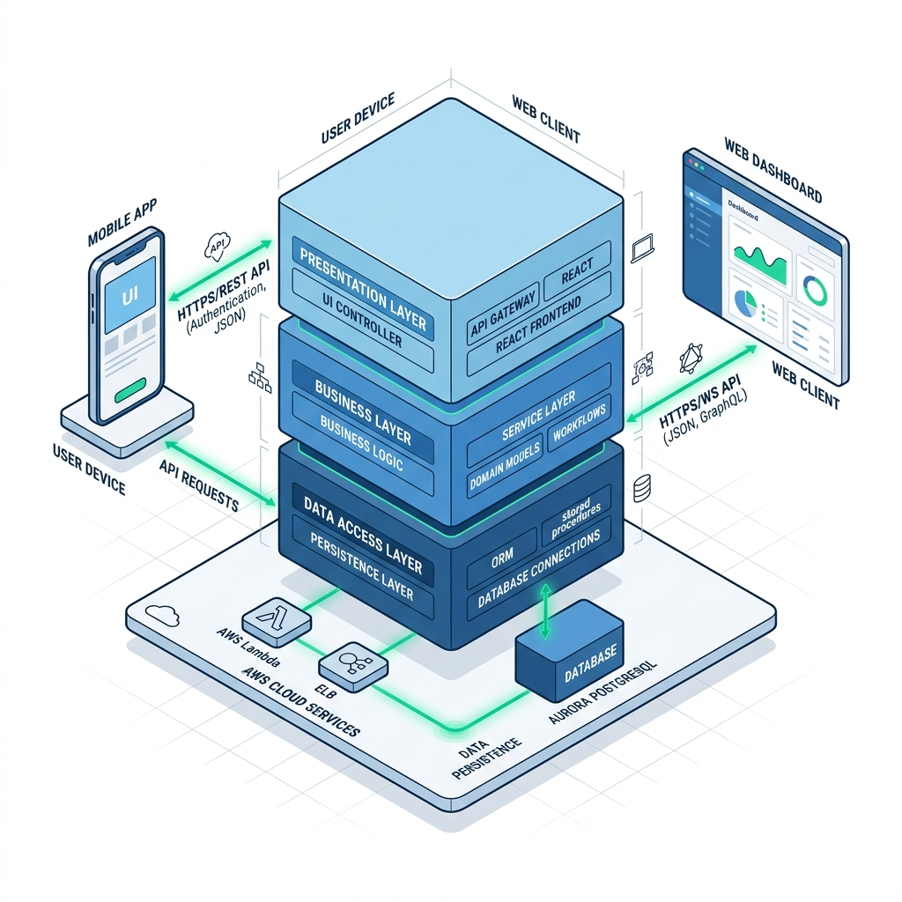
  <p><em>Blueprint vettoriale dell'architettura a 3 tier interconnessa con i client.</em></p>
  <br>
</div>

### 1. Server (Console Operativa e Backend Python)

<div align="left" style="display: flex; flex-wrap: wrap; gap: 10px; margin-bottom: 10px;">
  
  
  
  
  
</div>

Il cuore pulsante del sistema, scritto in **Python 3.11+**, è suddiviso logicamente in tre layer per rispettare i pattern architetturali e la Separation of Concerns (SoC). È amministrato in loco tramite una potente TUI (Text-User Interface).
* **Presentation Tier:** Intercetta le richieste dei client, gestisce il single sign-on, le sessioni e il controllo accessi. Espone i servizi applicativi tramite endpoint RESTful (`api_pubblica.py` basato su **FastAPI**) e gestisce in sicurezza autenticazione e sessioni (`api_gateway_sicurezza`). È il tier più soggetto a cambiamenti e il più flessibile.
* **Business Tier:** Contiene il vero nucleo vitale e la logica di dominio aziendale — è lo strato che **realizza i casi d'uso**. È strutturato in moduli indipendenti e altamente coesi: `gestore_corse` (per i cicli di noleggio), `gestore_flotta` (telemetria e stato veicoli), `gestore_geofencing` (zone vietate o a velocità ridotta), `gestore_profili_ekyc` (validazione identità utenti) e un `motore_analitica` per l'elaborazione dei dati per i comuni. La sua interfaccia è stabile e non dipende da framework di piattaforma.
* **Integration Tier:** Comunica con il mondo esterno isolando il Business Tier dalle librerie di terze parti — è il tier con i cambiamenti meno frequenti, ottimizzato per l'accesso a risorse esterne. Include il `data_access_manager` (per Firestore, equipaggiato con cifratura hardware-accelerated AES-256-GCM integrata nativamente tramite `cryptography`), e un vasto ecosistema di gateway: `gateway_iot` (comunicazione con i mezzi), `gateway_pagamenti`, `gateway_email`, `gateway_routing` e `gateway_ambientale`.

Gli amministratori di sistema interagiscono localmente con questo potente backend tramite una **Console Operativa** terminal-based (costruita con `rich` e `prompt_toolkit`).
I **comandi a disposizione** per orchestrare il sistema sono: `start`, `stop`, `restart`, `status`, `monitor`, `hw`, `op`, `query`, `backup`, `audit`, `cronologia`, `set`, `selftest`, `help`, `clear`, ed `exit`.

<div align="center">
  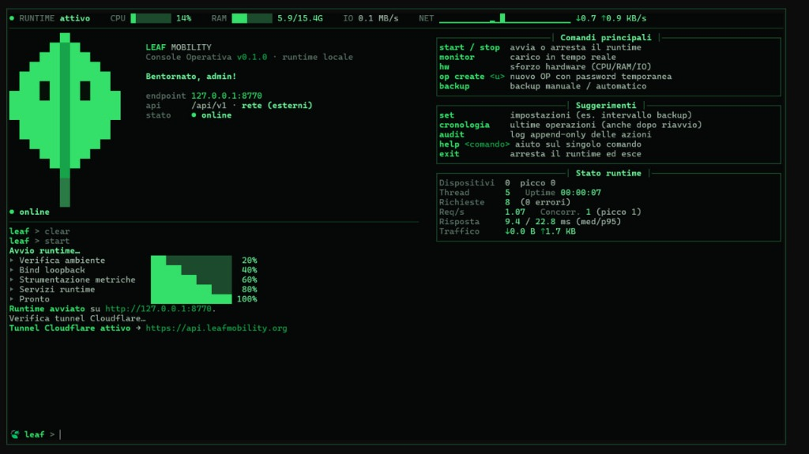
  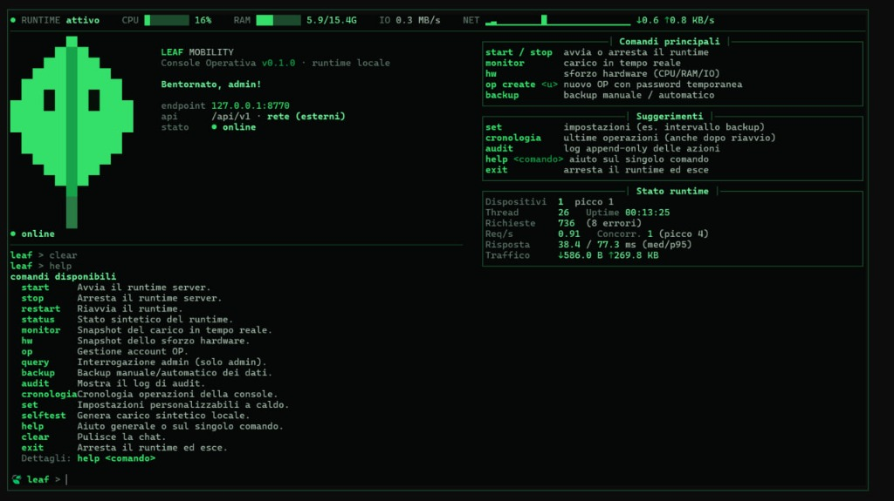
</div>
<br>
<div align="center">
  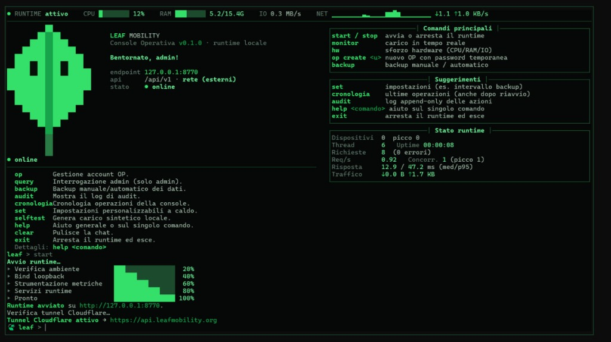
  <p><em>Il servizio si interfaccia su internet tramite tunneling Cloudflare.</em></p>
</div>

### 2. Web Dashboard (Flutter Web)

<div align="left" style="display: flex; gap: 10px; margin-bottom: 10px;">
  
  
  
</div>

Pannello di amministrazione e monitoraggio visivo della flotta e del territorio, interamente sviluppato nel framework **Dart/Flutter** per garantire un'esperienza Single-Page Application (SPA) responsiva ed estremamente reattiva.
* **A cosa serve:** Offre una visione d'insieme su mappa, report analitici e gestione avanzata delle regole di mobilità.
* **Chi lo usa:** Operatori di Flotta (per manutenzione, SOS, flotta) e Pubblica Amministrazione (per impatto ecologico, heatmap, report).
* **Cosa si può fare:** Monitorare i mezzi live, tracciare zone critiche, istituire regole di Geofencing (cantieri, slow-zone) e generare report.

> 📌 **Nota sull'accesso PA/OP:** La schermata di login per la Pubblica Amministrazione e per l'Operatore mostra le credenziali (password) in chiaro. Queste credenziali vengono inviate via email in fase di provisioning dell'account. Trattandosi di un sistema realizzato per un esame universitario, si è scelto di mantenerle visibili per semplicità dimostrativa.

<div align="center">
  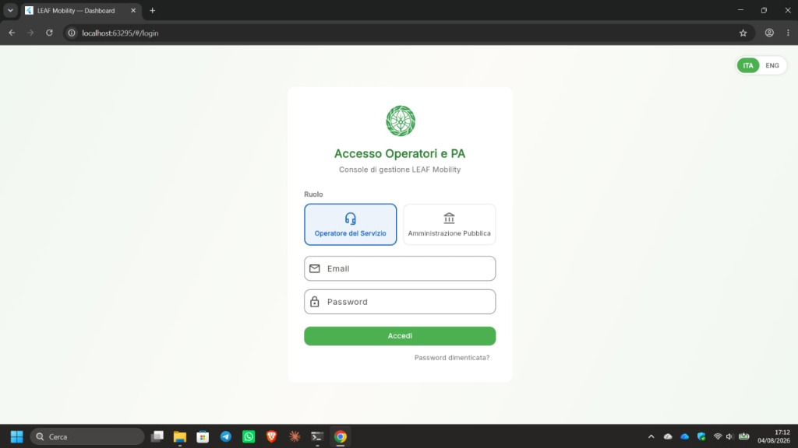
  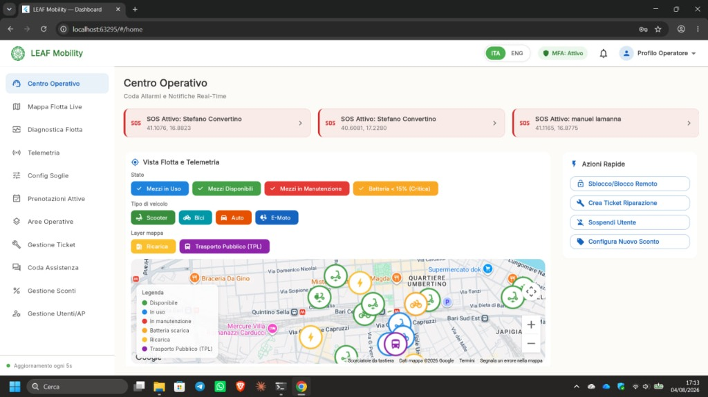
</div>

<details>
  <summary><b>Clicca qui per visualizzare gli altri screenshot della Dashboard</b></summary>
  <br>
  <div align="center">
    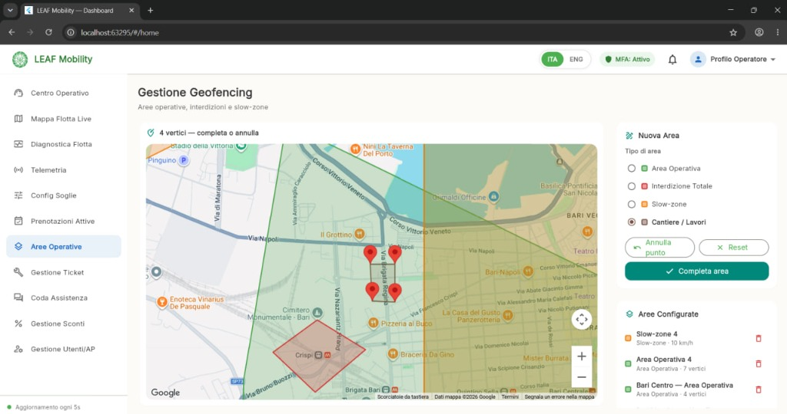<br><br>
    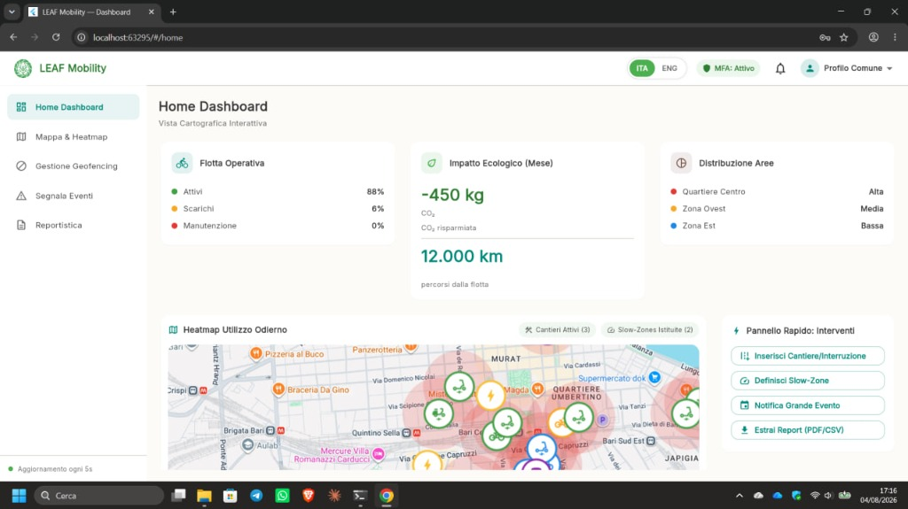<br><br>
    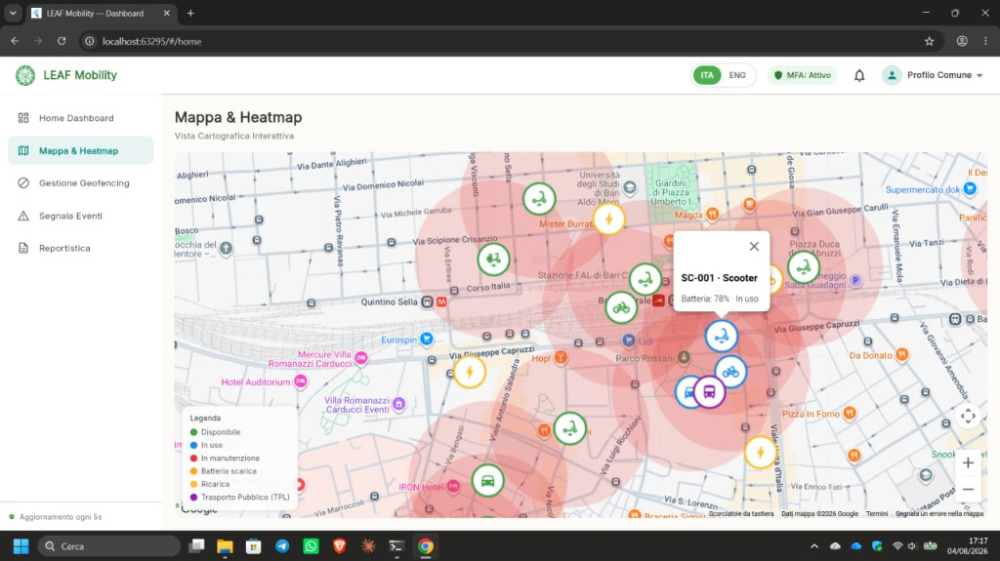<br><br>
    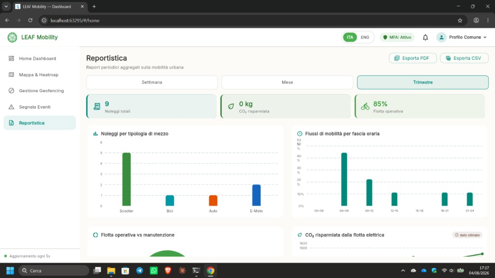
  </div>
</details>

### 3. App Mobile (Flutter iOS/Android)

<div align="left" style="display: flex; gap: 10px; margin-bottom: 10px;">
  
  
  
</div>

L'interfaccia utente finale per accedere ai servizi di LEAF Mobility, realizzata in **Flutter** per garantire deploy nativi multipiattaforma (iOS e Android) da una singola codebase.
* **A cosa serve:** Permette al cittadino di interagire con il sistema di noleggio e usufruire dei mezzi.
* **Cosa può fare:** Registrazione, acquisto abbonamenti, storico corse, sblocco veicolo e attivazione funzionalità salvavita (SOS Emergenza).

| Icona App | Home / Ricerca | Mappa Flotta | Abbonamenti | Storico Acquisti | Cronologia | Profilo Utente | Menù & SOS |
|:---:|:---:|:---:|:---:|:---:|:---:|:---:|:---:|
|  | 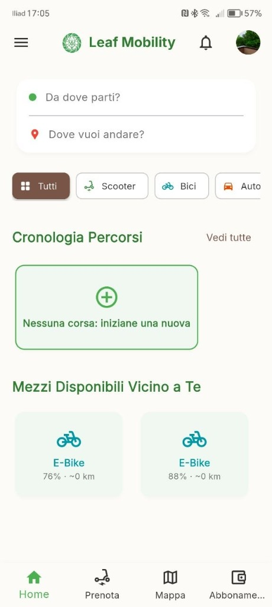 | 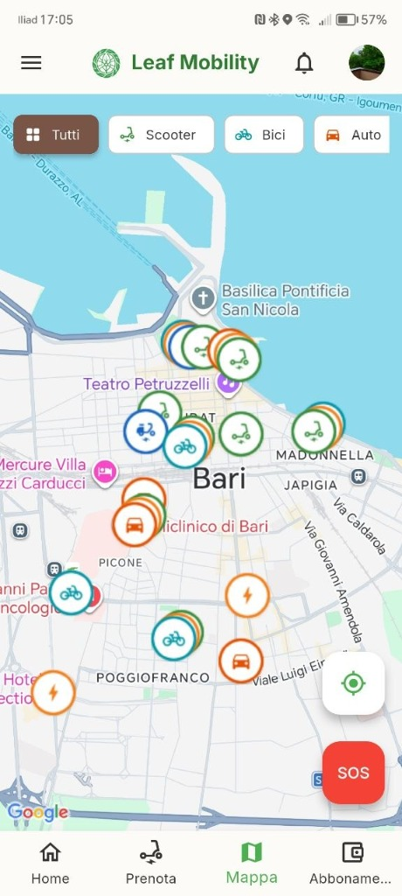 | 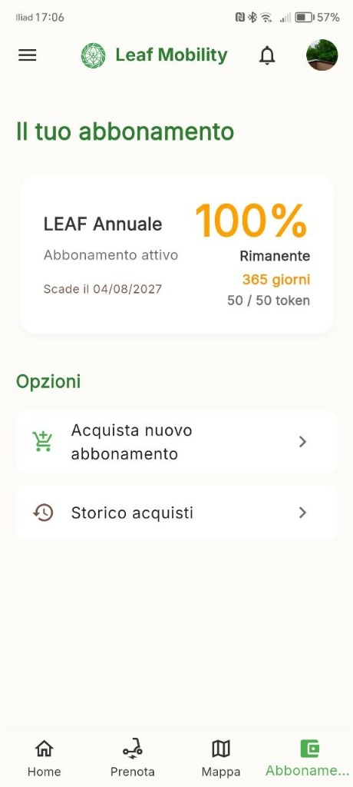 |  | 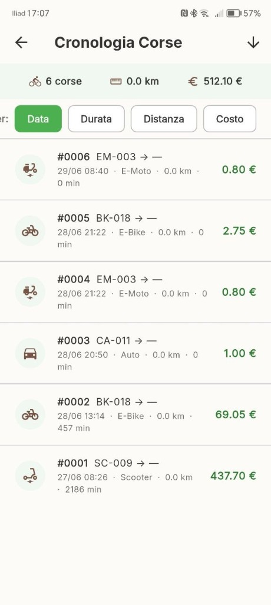 |  | 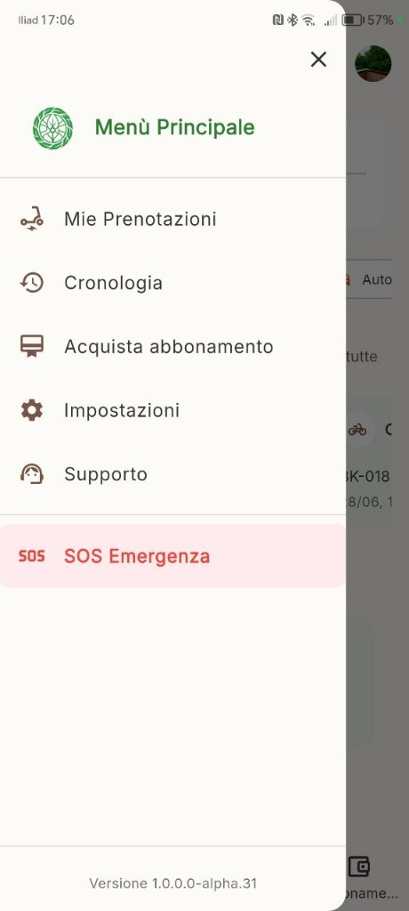 |

> ✉️ **Notifiche Smart:** Il sistema invia comunicazioni automatiche (ad esempio, [notifiche di sicurezza via email](docs/images/screenshot_11.jpg) per nuovi accessi).

---

## ⚙️ Requisiti e Servizi Black Box (Analisi Reale)

L'infrastruttura di progetto è stata analizzata a fondo e sfrutta servizi "black box" precisi per garantire funzionalità enterprise mantenendo scalabilità. I sistemi esterni sono interfacciati esclusivamente attraverso l'Integration Tier — nessun client accede mai direttamente a un servizio esterno.

### Analisi dei Servizi in uso

<div align="left" style="display: flex; align-items: center; gap: 10px; margin-bottom: 5px;">
  
</div>

- **Database e Auth (Firebase / Cloud Firestore):** Il backend Python fa largo uso di `firebase-admin` collegandosi a **Firestore** come database NoSQL primario.
  - **Predisposizione Architetturale:** L'architettura prevede che i client esterni (App Mobile, Web Dashboard) **non tocchino mai direttamente Firestore**. Tutte le chiamate passano rigorosamente attraverso l'Integration Tier del server (`DataAccessManager`).
  - **Sicurezza:** Viene implementata nativamente una libreria di cifratura (`cryptography` AES-256-GCM) per criptare i campi sensibili a riposo.

<div align="left" style="display: flex; align-items: center; gap: 10px; margin-bottom: 5px; margin-top: 15px;">
  
</div>

- **Tunneling (Cloudflare):** Per permettere il collegamento remoto alla console operativa, si utilizza il tunneling di Cloudflare. L'applicazione è configurata per usare il servizio di sistema di Cloudflare, rimpiazzando vecchi metodi deprecati. Questo fornisce un dominio sicuro e accessibile via link diretto.

<div align="left" style="display: flex; align-items: center; gap: 10px; margin-bottom: 5px; margin-top: 15px;">
  
</div>

- **Mappe (Google Maps Platform):** I client front-end impiegano la piattaforma Google (`google_maps_flutter`). Richiedono chiavi API valide per il corretto caricamento dei tile map.

---

## 🔄 Alternative Tecnologiche

Il sistema è stato progettato con interfacce modulari, permettendo di sostituire facilmente alcuni servizi Black Box con alternative (utili per lo sviluppo locale o in caso di fallback).

<div align="left" style="display: flex; align-items: center; gap: 10px; margin-bottom: 5px;">
  
</div>

- **Alternativa Locale (Firebase Emulator):** Il sistema è eccellentemente predisposto per lo sviluppo offline. In assenza di chiavi cloud, il server può girare *completamente offline* puntando all'emulatore Firebase locale (vedi `FIRESTORE_EMULATOR_HOST` in `.env.example`). Questa soluzione è vitale per eseguire i test senza intaccare i dati di produzione.

<div align="left" style="display: flex; align-items: center; gap: 10px; margin-bottom: 5px; margin-top: 15px;">
  
</div>

- **Tunneling Fallback (ngrok):** Se il nodo Cloudflare subisce interruzioni, **ngrok** è nativamente supportato dal sistema come fallback temporaneo per esporre la console operativa al web.

<div align="left" style="display: flex; align-items: center; gap: 10px; margin-bottom: 5px; margin-top: 15px;">
  
</div>

- **Mocking API (Postman / Swagger):** Grazie alla documentazione OpenAPI generata da FastAPI (Swagger UI), i team front-end possono disaccoppiare lo sviluppo dal server creando dei mock locali. Questo consente di iterare velocemente sulle interfacce (App e Dashboard) senza dover accendere l'infrastruttura backend.

<div align="left" style="display: flex; align-items: center; gap: 10px; margin-bottom: 5px; margin-top: 15px;">
  
</div>

- **Esecuzione Isolata (Containerizzazione):** Invece di eseguire il backend *bare-metal* tramite virtual environment, il Presentation e il Business Tier sono concepiti per essere facilmente *containerizzati* (Docker). Questo risolve alla radice eventuali conflitti di dipendenze del sistema operativo host.

---

## 🚧 Limitazioni e Sistemi Simulati (Mock)

Trattandosi di un progetto accademico, l'architettura è **completamente predisposta per il "plug-and-play"** verso il mondo fisico, ma le reali integrazioni (hardware e servizi a pagamento) sono gestite nell'Integration Tier tramite simulazioni locali deterministiche:

- **SOS Emergenza (Nessuna chiamata 112):** Il pulsante SOS in app non allerta le vere Autorità, ma genera un allarme critico (WebSocket/API) in tempo reale sulla console della Web Dashboard per la presa in carico da parte di un operatore interno.
- **Gateway Pagamenti (Nessun addebito):** Manca il cablaggio con veri PSP (es. Stripe). Le carte vengono tokenizzate e validate localmente (checksum di Luhn e scadenza), restituendo un esito di approvazione fittizio senza movimentare denaro.
- **Flotta e Hardware IoT (Dati fittizi):** I mezzi visualizzati in mappa non esistono fisicamente. La telemetria GPS, così come lo sblocco/blocco dei mezzi e le funzioni anti-spostamento, sono simulate server-side in modo parametrico (nessun broker MQTT reale).
- **Gateway Ambientale (Clima mockato):** I dati su temperatura, condizioni climatiche ed emissioni ecologiche risparmiate non sono acquisiti da API meteo live o sensori fisici. I valori sono interamente generati per dimostrare la reportistica lato PA.
- **Gateway Email (Nessun invio SMTP):** L'invio di notifiche di sistema, avvisi di sicurezza ed esiti e-KYC avviene tramite un mock "best-effort". Le email non arrivano alle vere caselle di posta degli utenti registrati.

---

## 🔒 Elementi Sensibili Non Inclusi (Privacy)

A scopo di sicurezza, i seguenti asset critici sono stati deliberatamente esclusi dal repository pubblico e inseriti nel `.gitignore`:
- **Configurazioni Ambientali:** File contenenti segreti di sistema, token di autenticazione e chiavi crittografiche simmetriche (utilizzate per la cifratura a riposo dei dati).
- **Service Account IAM:** Certificati con privilegi amministrativi (file JSON) necessari all'inizializzazione dell'SDK server per l'accesso al database cloud.
- **Chiavi API Esterne:** Token e secret key per i servizi di tunneling sicuro e le quote dei provider di mappatura (es. piattaforme Maps).

---

## 🚀 Per Sviluppatori Esterni (Avvio Locale)

Se sei uno sviluppatore esterno alla **SunGroup**, sappi che il progetto impone standard rigorosi per il ciclo di integrazione continua (CI).

### 1. Avviare il Server (Python 3.11+)
Il server agisce da runtime operativo ed esegue stretti controlli pre-commit (`mypy` in strict mode, `ruff` per il linting e la formattazione, e una rigorosa test coverage tramite `pytest`).

```sh
# Entra nella root o nella directory del server
cd server

# Installa tutte le dipendenze, inclusi i tool di CI
pip install -r requirements.txt

# Avvia la console operativa
python -m console_operativa
```
*(Suggerimento: Configura le variabili in `server/.env.example` rinominandolo in `.env` per attivare la modalità emulatore senza credenziali).*

### 2. Avviare la Web Dashboard (Flutter)
Richiede l'SDK Dart/Flutter aggiornato.
```sh
# Entra nella directory della dashboard
cd client/web_dashboard

# Scarica i pacchetti necessari
flutter pub get

# Avvia la dashboard localmente
flutter run -d chrome
```

---

## 🧪 Testing e Collaudo

Il progetto garantisce la qualità e l'integrità del codice attraverso suite di test rigorose e un protocollo CI/CD automatizzato con **13 controlli** (7 di integrazione continua + 4 di sicurezza + 2 architetturali). Prima di ogni commit, è obbligatorio assicurarsi che il codice passi i controlli formali e i test di unità. L'architettura software è progettata per essere altamente testabile, grazie alla separazione in tier e all'uso di mock per simulare servizi esterni o database.

### 1. Test di Unità e Copertura (Coverage)
I test di unità sono focalizzati sulla validazione della logica di business e dei singoli moduli (Business Tier), isolandoli dalle dipendenze esterne. Utilizziamo `pytest` come framework principale.

```sh
# Esecuzione dei test con report di copertura (Coverage)
pytest --cov=server tests/
```

### 2. Controllo Statico e Analisi del Codice
Per mantenere un alto livello di qualità e coerenza del codice, vengono eseguiti rigorosi controlli statici:

```sh
# Controllo statico dei tipi (obbligatorio per superare la CI)
mypy --strict server/

# Linting e formattazione automatica
ruff check server/
```

### 3. Mock e Simulazioni per i Test
Considerata l'interazione con hardware IoT e servizi esterni (Google Maps, Cloudflare, Email), durante il collaudo locale:
- I servizi a pagamento o Black Box (Gateway Pagamenti, SOS, Invio Email, Routing) vengono **mockati** o bypassati tramite implementazioni fittizie.
- Le interazioni con il database cloud possono essere condotte sull'**Emulatore Firebase** locale per non intaccare i dati di produzione.

---

## 📊 Analisi Multidimensionale (ESG, Qualità e Rischi)

Il progetto LEAF Mobility è stato monitorato lungo tutto il suo ciclo di vita attraverso un set di metriche non puramente ingegneristiche, ma estese alla sostenibilità ambientale, sociale e di governance (ESG). I dati completi sono archiviati in [`Report/kpi_non_economici.md`](Report/kpi_non_economici.md) (e analizzati visivamente dalla dashboard interattiva `Report/dashboard_kpi_opensource.py`).

Di seguito i principali risultati raggiunti al termine dello Sprint 3:

- **Eccellenza Tecnica (Debito SQALE):** Miglioramento dal Rating D (24%) iniziale all'attuale **Rating A (3,8%)**.
- **First-Pass Rate:** L'87% dei gate automatizzati (20 su 23) è stato superato al primo tentativo.
- **Metriche ESG (Environmental & Governance):** Punteggio pieno sull'impatto ambientale (grazie al monitoraggio CO₂ e alla flotta 100% elettrica) e ottima governance dei dati (Audit, MFA, RBAC).
- **Gestione dei Rischi:** Il 60% dei rischi identificati (es. debito tecnico elevato, problemi di deployment) si è materializzato, ma è stato gestito abbassando l'impatto residuo al minimo.

### 🌐 Impronta di Qualità e Sostenibilità (ISO 25000)

<div align="center">
  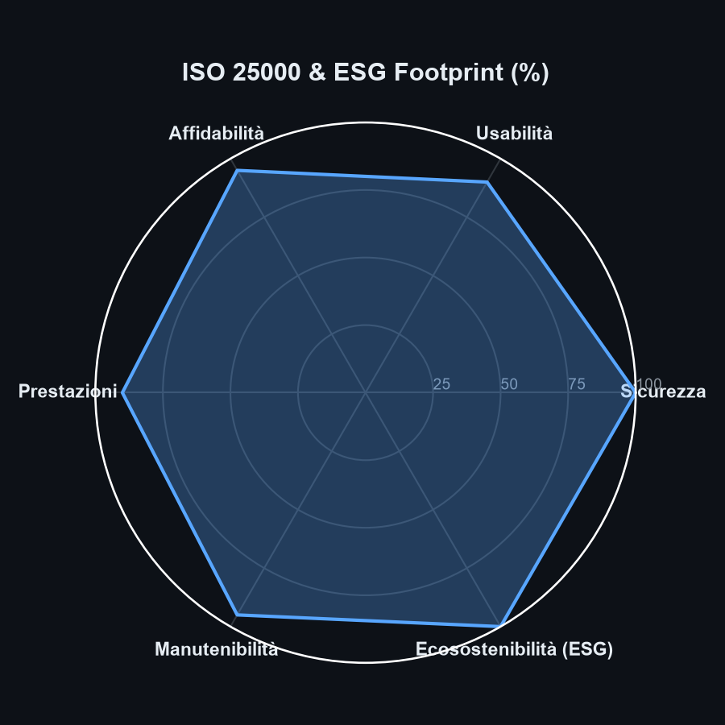
</div>

### 🛡️ Qualità del Rilascio ed E2E

<div align="center">
  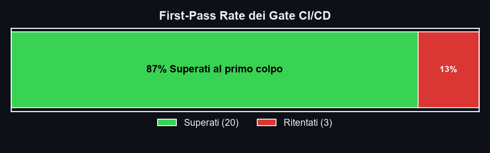
</div>

<div align="center">
  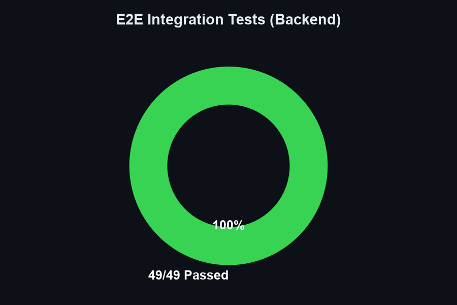
</div>

### 🕸️ Equilibrio Tecnico, Team ed ESG

<div align="center">
  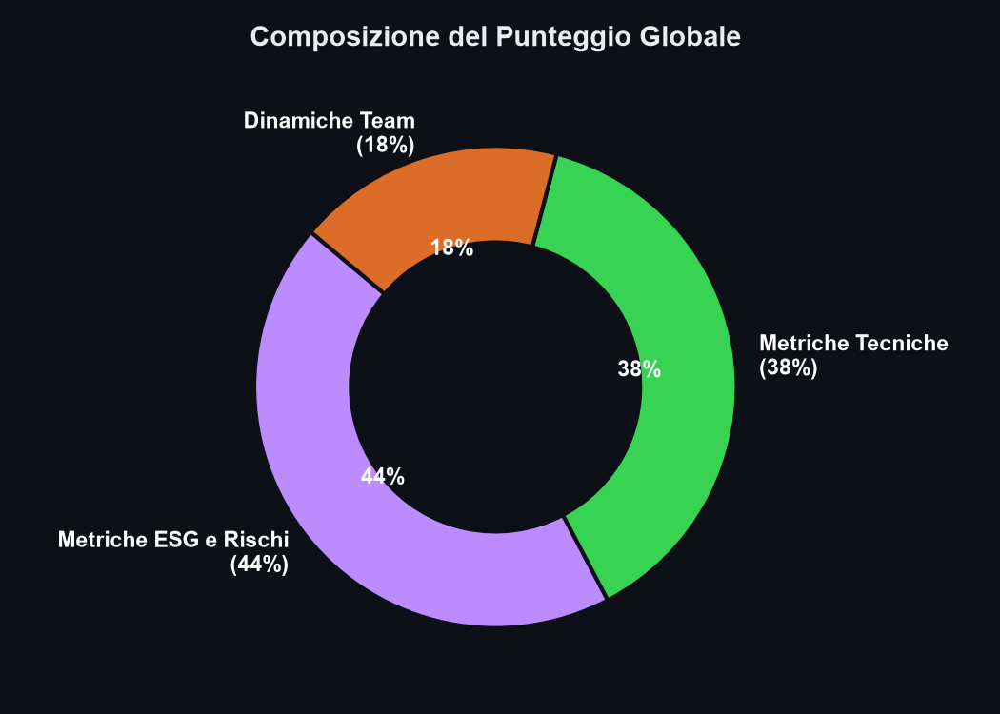
</div>

### 📦 Governance e Sicurezza Supply Chain (SBOM)

<div align="center">
  
</div>

### 📉 Evoluzione del Debito Tecnico (SQALE)

<div align="center">
  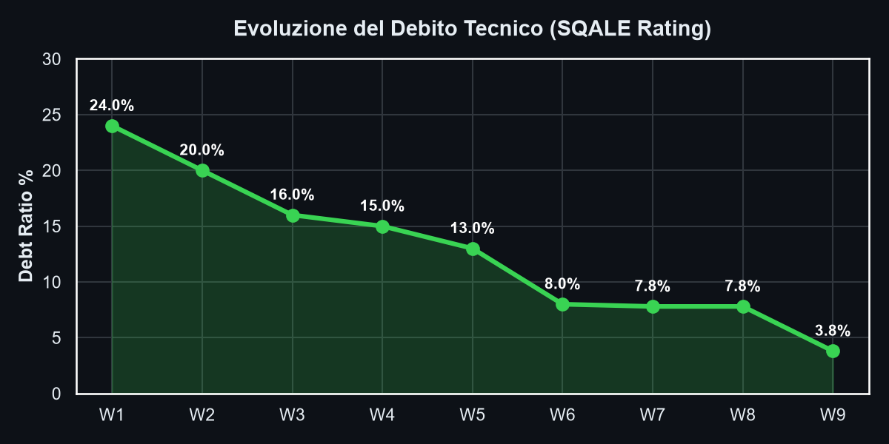
</div>

### ⚖️ Dinamiche del Team e Rischi Operativi

<div align="center">
  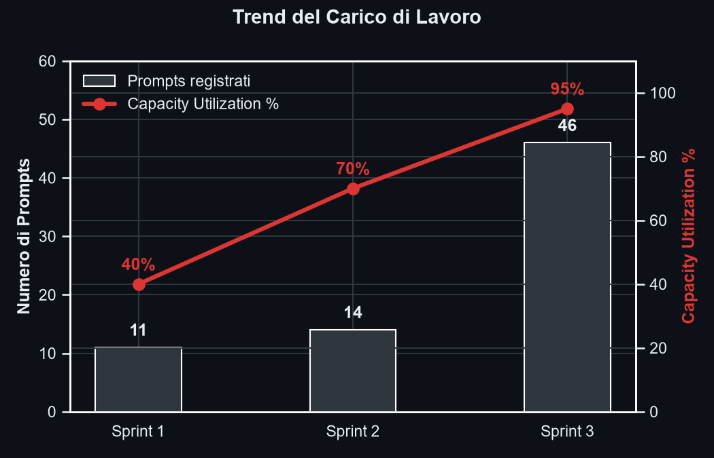
</div>

<div align="center">
  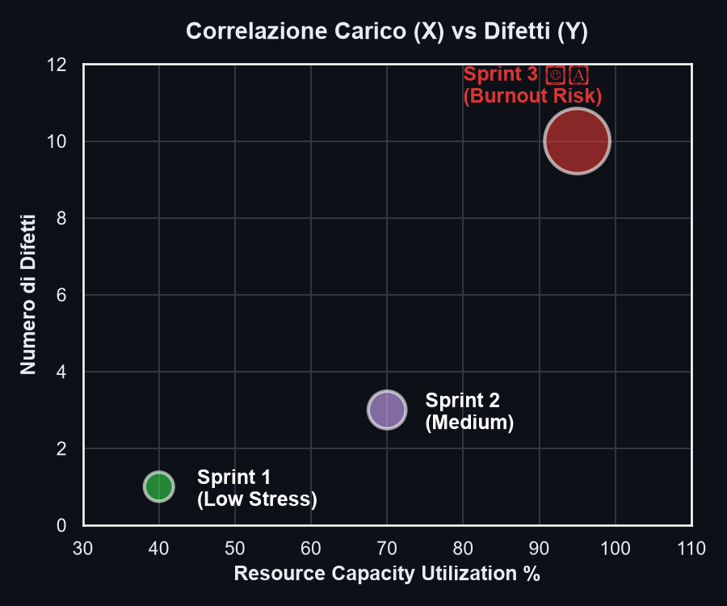
</div>

> [!WARNING]
> **Aree di miglioramento operativo:** Durante lo Sprint 3 si è registrata una *Resource Capacity Utilization* superiore al 95% e uno sbilanciamento nella contribuzione del team. Come visibile dai grafici, all'aumentare estremo del carico corrisponde un'impennata di difetti (fenomeno *Velocity Mirage*). Questi indicatori suggeriscono l'adozione futura di sessioni obbligatorie di Pair Programming per mitigare il rischio di burnout.

---

## ⚠️ Problematiche Note e Troubleshooting

- **Latenza Iniziale del Tunneling (Cloudflare):** Il servizio di tunneling non soffre di instabilità, ma può presentare un ritardo nel primo *handshake* di connessione ("cold start"). Ai primi tentativi di accesso dall'esterno, l'endpoint potrebbe non rispondere immediatamente. Si consiglia di attendere qualche istante e tentare un refresh affinché la rotta venga stabilita correttamente.
- **Quota API e Rendering Mappe:** Se durante lo sviluppo la mappa non viene visualizzata (o presenta la schermata grigia di errore), verificare che la chiave API di Google Maps Platform sia inserita correttamente e non abbia esaurito le quote gratuite mensili.
- **Limitazioni Emulatore Offline:** Quando si opera in modalità sviluppo con l'emulatore Firebase locale (senza le credenziali `.json`), i dati rimangono volatili e limitati alla sessione corrente.
- **Strict Linting Python:** Il backend applica un controllo dei tipi estremamente rigoroso tramite `mypy --strict`. Qualsiasi modifica rapida che non rispetta le firme dei tipi farà fallire i controlli pre-commit per preservare la solidità del codice.

---

## 🔮 Evoluzione e Migliorie Future

Il sistema è stato progettato fin dall'inizio con la **modularità** e l'**anticipazione del cambiamento** come principi guida (Ghezzi et al.), e l'architettura a tre tier facilita l'evoluzione senza ristrutturazioni invasive. Di seguito le migliorie identificate per portare LEAF Mobility verso un livello di maturità superiore.

### 1. Architettura Distribuita Multi-Server

Attualmente l'intero backend gira su un **singolo nodo** (una macchina fisica o virtuale). In uno scenario di produzione reale, con migliaia di utenti concorrenti, sarebbe necessario distribuire il carico su più server. Questo comporterebbe:
- **Bilanciamento del carico (Load Balancer):** un reverse proxy (es. NGINX, HAProxy) che distribuisca le richieste in ingresso tra più istanze del Presentation Tier, garantendo alta disponibilità e fault tolerance.
- **Comunicazione inter-nodo:** un sistema di messaggistica asincrona (es. **RabbitMQ**, **Apache Kafka**) per coordinare i server tra loro — ad esempio, propagare in tempo reale gli aggiornamenti di stato della flotta o gli allarmi SOS a tutte le istanze.
- **Sessioni distribuite:** migrare la gestione delle sessioni utente da in-memory a un datastore condiviso (es. **Redis**), in modo che qualsiasi nodo possa servire qualsiasi utente senza perdita di stato.
- **Horizontal scaling:** la possibilità di aggiungere o rimuovere istanze server in modo dinamico in base al carico, idealmente orchestrato da Kubernetes.

### 2. Caching Layer e Ottimizzazione delle Query

L'architettura attuale accede direttamente a Cloud Firestore per ogni richiesta. Per un sistema in produzione con alta frequenza di letture (posizioni mezzi, stato flotta, configurazione geofencing), sarebbe opportuno introdurre:
- Un layer di **cache in-memory** (es. **Redis** o **Memcached**) tra il Business Tier e il `DataAccessManager`, con politiche di invalidazione TTL o event-driven.
- **Cache lato client** con strategie di stale-while-revalidate per i dati della mappa e dello stato della flotta, riducendo le chiamate API e la latenza percepita.

### 3. Notifiche Push Native

Il sistema attuale non dispone di un canale di notifica push nativo verso i dispositivi mobili. L'integrazione con **Firebase Cloud Messaging (FCM)** o un servizio equivalente permetterebbe:
- Notifiche in tempo reale per scadenza prenotazione, fine corsa, promozioni e avvisi di servizio direttamente sul lock screen del dispositivo.
- Notifiche silenziose per aggiornamenti dello stato della flotta in background.
- Canale separato per le **notifiche critiche SOS** verso gli operatori.

### 4. Pipeline CI/CD Automatizzata

I controlli CI/CD (13 gate definiti nel protocollo di progetto) vengono attualmente eseguiti manualmente o semi-automaticamente in sessione. Una pipeline completa su **GitHub Actions** o equivalente permetterebbe:
- Esecuzione automatica di `ruff`, `mypy --strict`, `pytest`, `flutter analyze` e `flutter test` ad ogni push e pull request.
- Build automatizzata dell'APK release e deployment degli artefatti.
- Gate di merge bloccanti che impediscano il push di codice non conforme.

### 5. Machine Learning per la Domanda Predittiva

Il `motore_analitica` attuale elabora statistiche descrittive (heatmap, conteggi, CO₂). Un'evoluzione naturale sarebbe integrare modelli di **machine learning predittivo** per:
- **Previsione della domanda** per zona e fascia oraria, consentendo il riposizionamento proattivo dei mezzi prima dei picchi.
- **Manutenzione predittiva** basata sui pattern di telemetria IoT (cicli di carica, vibrazioni anomale, usura stimata).
- **Pricing dinamico** in base a domanda/offerta in tempo reale e condizioni meteo.

### 6. Gamification e Fidelizzazione

Per incentivare l'uso responsabile e la fidelizzazione degli utenti, si potrebbe introdurre un sistema di:
- **Punti e livelli** (es. "Eco Rider", "Urban Explorer") basati su km percorsi, parcheggi virtuosi e valutazioni positive.
- **Sfide settimanali** e **classifiche** tra utenti della stessa zona.
- **Ricompense convertibili** in crediti di noleggio, sconti o benefit presso partner locali.

### 7. Containerizzazione e Orchestrazione

Sebbene l'architettura sia *predisposta* per la containerizzazione (menzionata tra le alternative tecnologiche), non sono attualmente presenti:
- **Dockerfile** per ciascun tier del server.
- File **`docker-compose.yml`** per l'avvio dell'intero stack (server + emulatore Firebase + Cloudflare tunnel) con un singolo comando.
- Manifesti **Kubernetes** (o Helm chart) per il deploy in ambienti cloud gestiti (GKE, EKS, AKS) con auto-scaling e self-healing.

### 8. Integrazione Reale dei Gateway Simulati

I gateway attualmente mockati (§ Limitazioni) sono progettati con interfacce ben definite che ne rendono immediata la sostituzione con implementazioni reali:
- **Pagamenti:** integrazione con **Stripe** o **PayPal** per transazioni reali con tokenizzazione PCI-DSS.
- **Email:** collegamento a un provider SMTP transazionale (es. **SendGrid**, **Amazon SES**) per l'invio effettivo di notifiche, OTP e fatture.
- **IoT:** protocollo **MQTT** su broker reale (es. **Mosquitto**, **HiveMQ**) per la comunicazione bidirezionale con i veicoli fisici.
- **Meteo e Ambiente:** integrazione con API meteo live (es. **OpenWeatherMap**) e dati ambientali reali per la reportistica PA.

---

## 📄 Licenza, Diritti e Versioning

> 📌 **Note di Rilascio:** Per la cronologia completa delle versioni, le decisioni architetturali e il tracciamento dettagliato delle nuove funzionalità implementate ad ogni Sprint, si prega di consultare il file [`CHANGELOG.md`](CHANGELOG.md) allegato al repository.

Questo software è distribuito e tutelato sotto **Licenza GNU** (GNU General Public License). Il codice sorgente, l'infrastruttura e la documentazione sono forniti secondo i termini esplicitati nel file di licenza presente nel repository. 
Il presente progetto è stato progettato e sviluppato dal team **SunGroup** per l'esame accademico 2025/26 (Ingegneria del Software - Università degli Studi di Bari), nel pieno rispetto dei vincoli accademici e della filosofia open-source.
